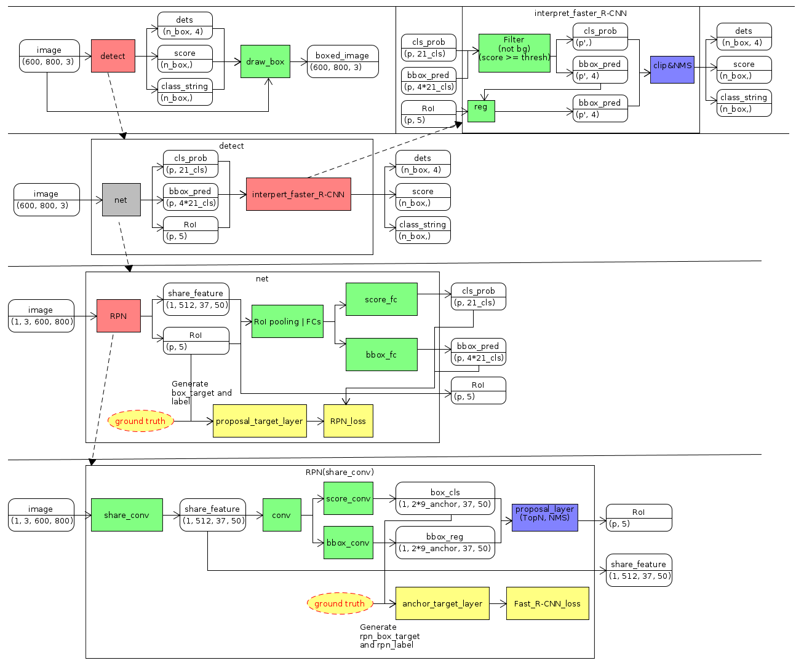

# Faster_R-CNN_pytorch
- Modifed based on  [**longcw/faster_rcnn_pytorch**](https://github.com/daviddao/spatial-transformer-tensorflow) .  
- Implementation of [**Faster R-CNN: Towards Real-Time Object Detection with Region Proposal Networks**](https://arxiv.org/abs/1506.01497).  

## Statement
- Based on **longcw/faster_rcnn_pytorch (python2.7)**, I modified the code to **python3.6** and **numpy 1.13.3**. So the numpy version do not need to change into 1.11.
- Follow **longcw**'s code, I draw some picture to understand the process of Faster R-CNN.

Thank **longcw**, his code helps me a lot to understand Faster R-CNN. Also the readme files of **longcw** and **ruotianluo** tell me how to build cython models. You can also follow their code and readme file.

**If there is something I can not write in my repertory, please contact me.**

## Environment and Compile
- python 3.6
- pytorch 0.3.0
- numpy 1.13.3
- opencv 3.3.0


Follow [**longcw/faster_rcnn_pytorch**](https://github.com/longcw/faster_rcnn_pytorch) and [**ruotianluo/pytorch-faster-rcnn**](https://github.com/ruotianluo/pytorch-faster-rcnn).

1. Install requirements (directly copy from [**longcw/faster_rcnn_pytorch/README.md**](https://raw.githubusercontent.com/longcw/faster_rcnn_pytorch/master/README.md)).

    ```
    conda install pip pyyaml sympy h5py cython numpy scipy
    conda install -c menpo opencv3
    pip install easydict
    ```
  
2. Choose arch of GPU type. (directly copy from[**ruotianluo/pytorch-faster-rcnn/README.md**](https://raw.githubusercontent.com/ruotianluo/pytorch-faster-rcnn/master/README.md))

  | GPU model  | Architecture |
  | ------------- | ------------- |
  | TitanX (Maxwell/Pascal) | sm_52 |
  | GTX 960M | sm_50 |
  | GTX 1080 (Ti) | sm_61 |
  | Grid K520 (AWS g2.2xlarge) | sm_30 |
  | Tesla K80 (AWS p2.xlarge) | sm_37 |
  
  modify the parameter **arch** in **faster_rcnn_pytorch/faster_rcnn/make.sh**
  
3. Build Cython models (directly copy from [**longcw/faster_rcnn_pytorch/README.md**](https://raw.githubusercontent.com/longcw/faster_rcnn_pytorch/master/README.md)).

    ```bash
    cd faster_rcnn_pytorch/faster_rcnn
    ./make.sh
    ```

## Run
You can follow [**longcw/faster_rcnn_pytorch**](https://github.com/daviddao/spatial-transformer-tensorflow) .

- **demo.py**  You need to download **trained_weights(VGGnet_fast_rcnn_iter_70000.h5)** and load it's weight.
- **train.py** You need to download **VOC dataset** and ** VGG_imagenet_pretrained_weight(VGG_imagenet.npy)**.
- **test.py** YOu need to download **VOC dataset**.

## Process of Code


